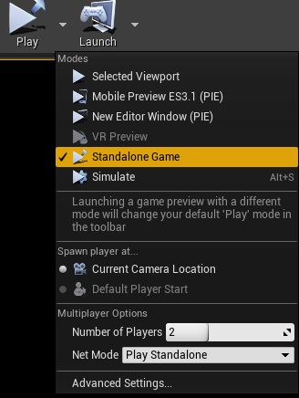
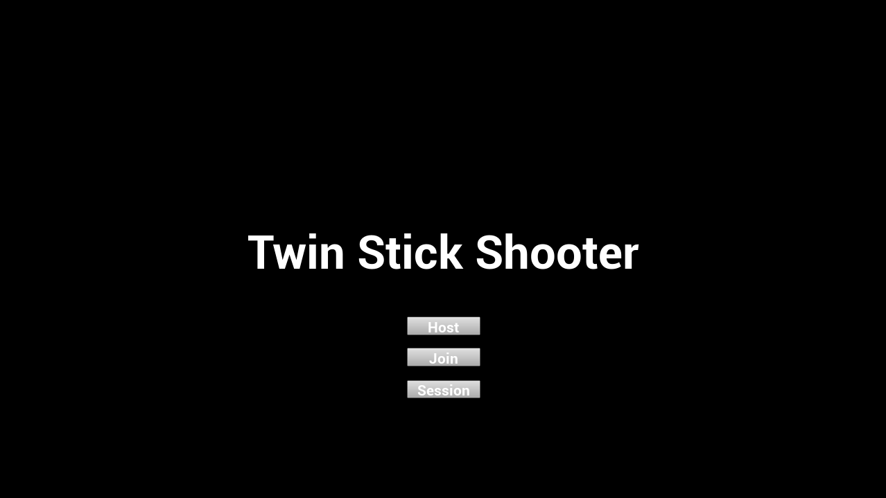
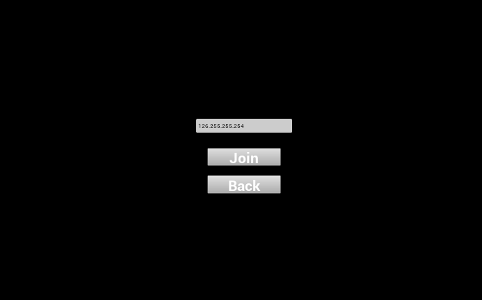
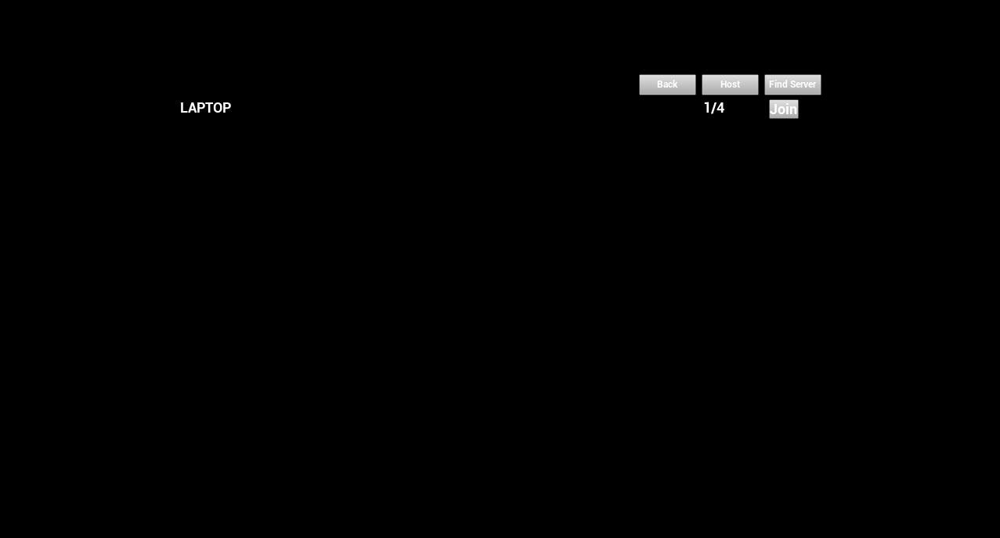

# TwinStickShooterMulti

## Description
TwinStickShooter template from UE4 with multiplayer implemented.

## How to test
Launch the TwinStickShooter.uproject, set the number of players between 2 and 4 and launch the clients in standalone game.

Select `Host` to host the party, `Join` to join a party with a specific IP adress and `Session` to search available party.

## Multiplayer GIF:

## Features:
	- You can host and join with IP adress.
	- There is a menu session where you can search for session or host one.
	- The gameplay works on both side (host and client).
	- Players scores are displayed next to their username.
	- You can change your username.

## Missing Features:
	- There is no options (number of kill in order to win, change the color of pawns ...)
	- There is no sound played in the client's game.
	- There is no win condition.

## bugs:
	- When the host close the game, the clients can't host.
	- The player order can change between host and clients.